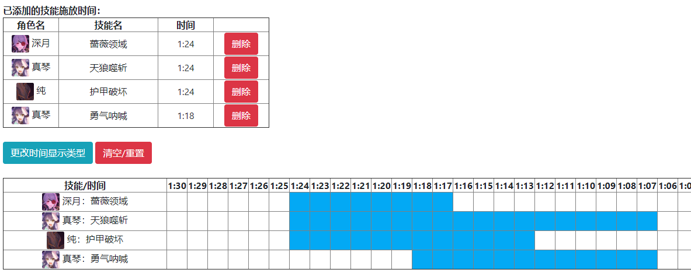

# 真步笔记 MahoNotes
一个简单的公主连结Re:Dive的计轴器。

因为~~懒得做~~时间关系，暂时只支持``国服``已经实装的角色，可添加的技能只包括UB与破甲、加攻技能（也够用了）。

未来也许会添加台服，甚至日服已经实装的角色。或者是永远也不会添加。

|  版本   | 实例  |
|  :--:  | :--:  |
| 正式版  | https://pinkchampagne17.github.io/MahoNotes/ |
 

截图中蓝色的部分为buff的持续时间。

## 适用的游戏版本
- [x] 国服 (bilibili)
- [ ] 港澳台服 (So-net Entertainment Taiwan)
- [ ] 日服 (Cygames)

## 支持语言
- [x] 简体中文
- [ ] 繁體中文
- [ ] 日本語
- [ ] English

## 技术栈
- Vue.js
- Bootstrap v4
